# Solace Express

*Formerly Air Xpress. On first launch, saves, settings and radio stations move from `%APPDATA%\AirXpress` to `%APPDATA%\SolaceExpress`.*

A pilot-career flight game for Windows with a real-time **GPU ray-traced** world. You start as a student with a permit, earn your licences, rent small planes to haul cargo, rent bigger ones to fly passengers, then buy your own aircraft for longer, harder contracts: mountain strips, glaciers, volcano fields, night storms and finally your own airline.

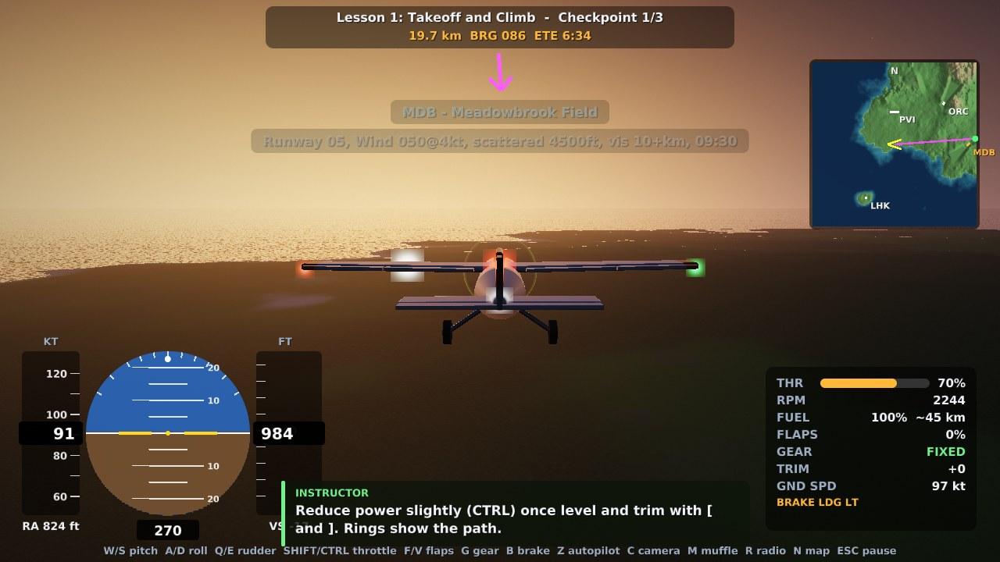

| | |
|---|---|
| 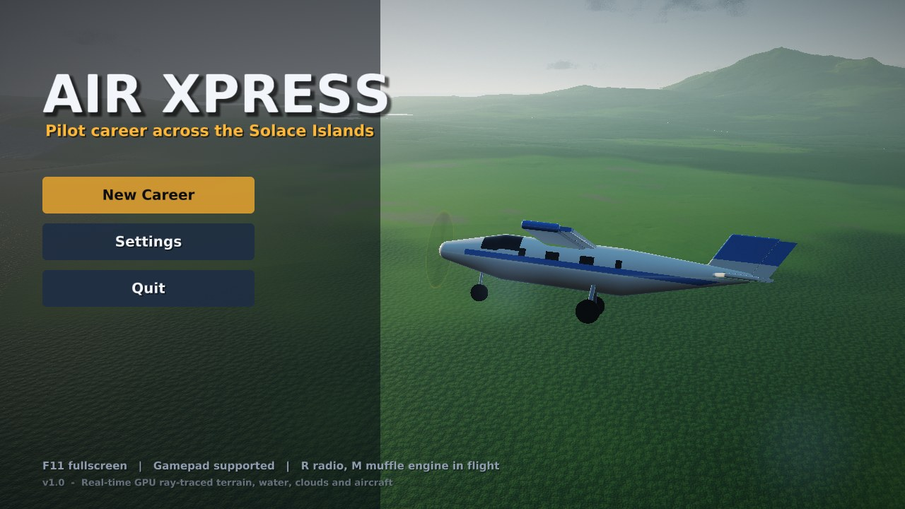 | 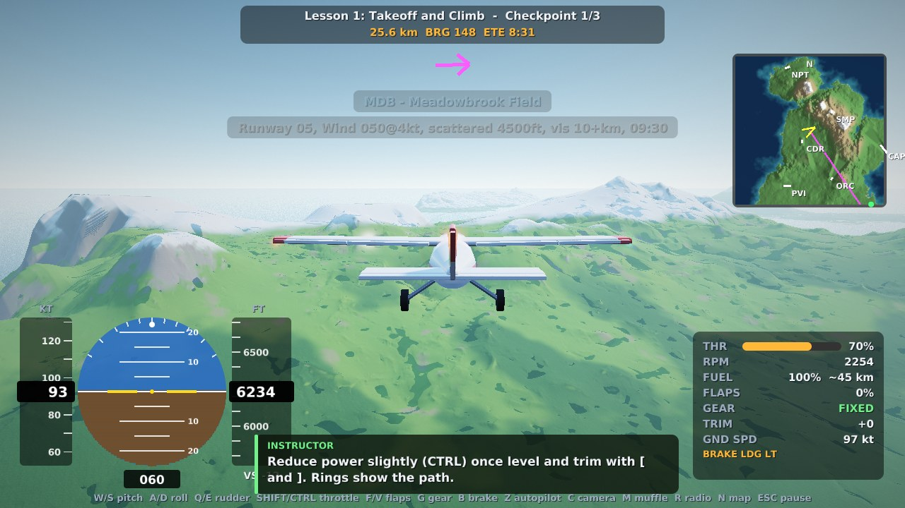 |
| 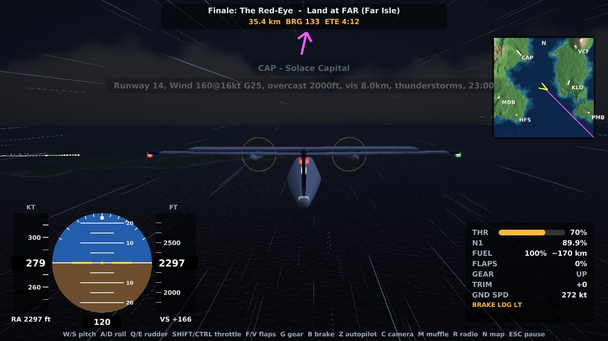 | 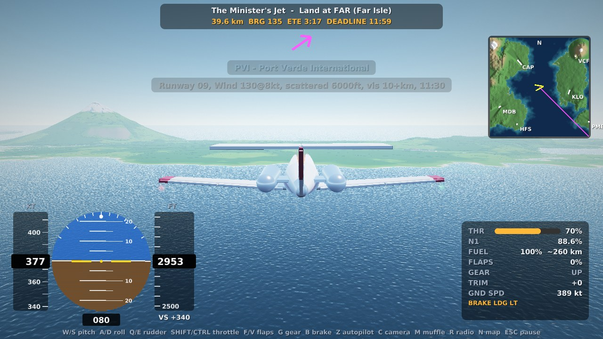 |
| 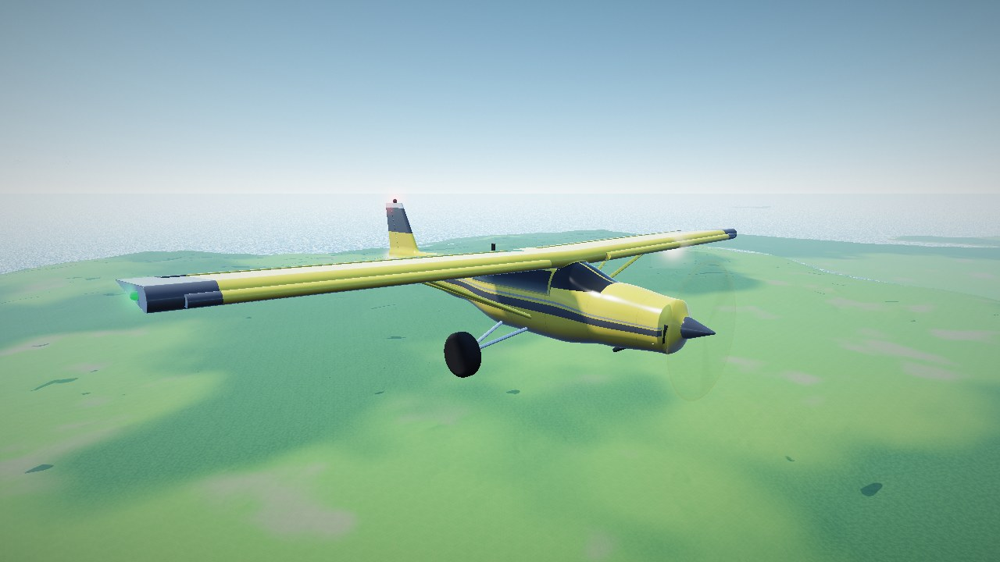 | 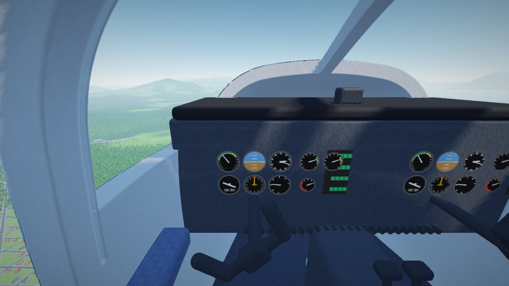 |
| 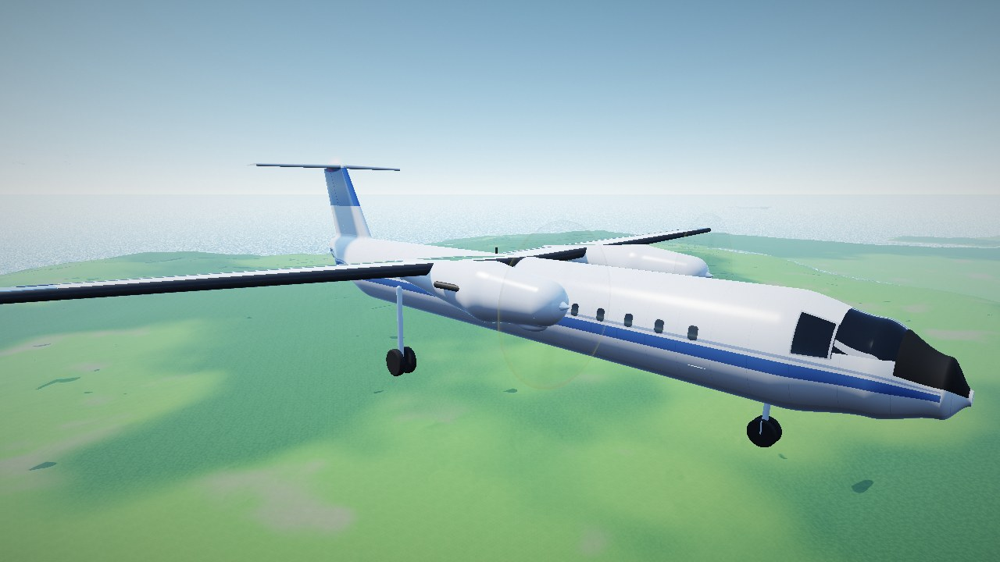 | 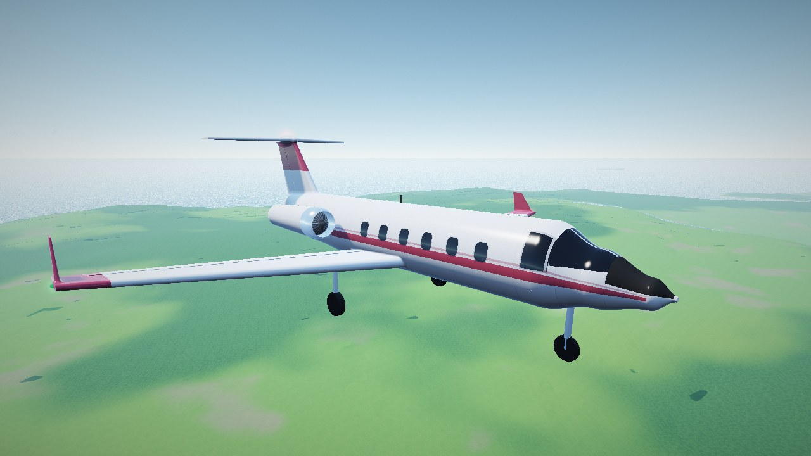 |
| 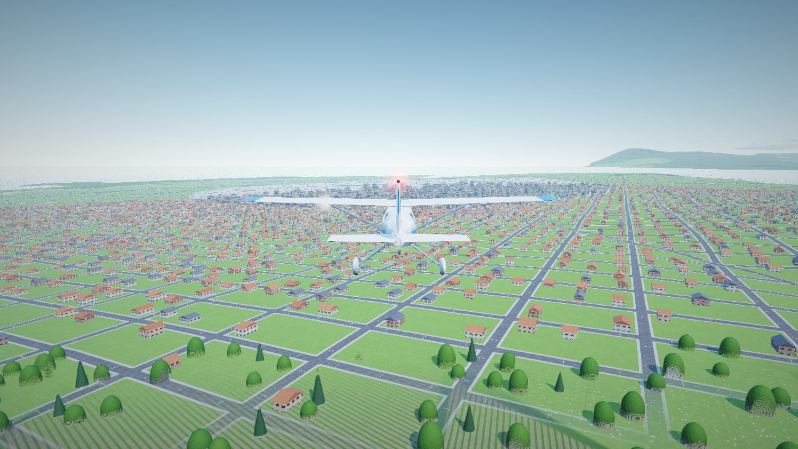 | 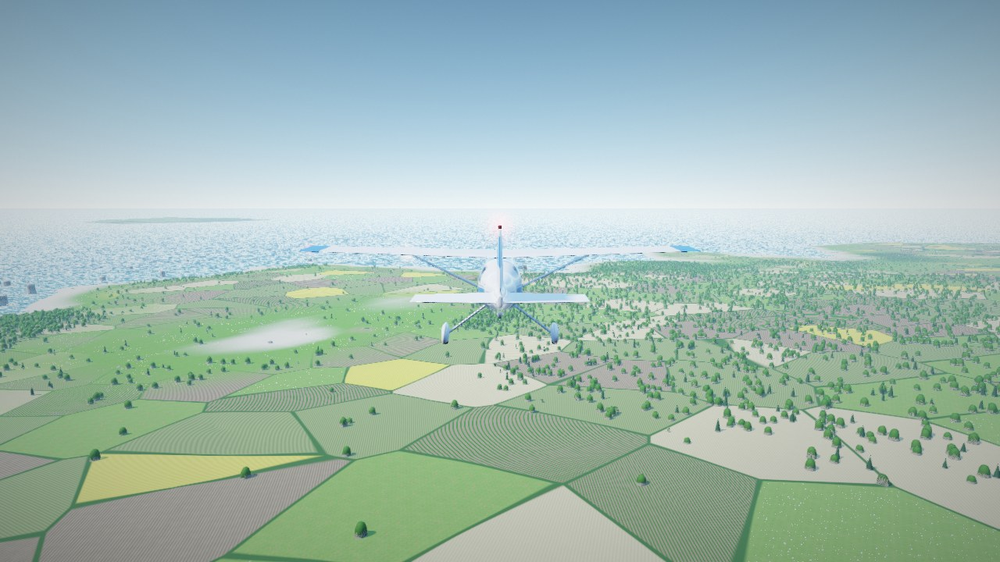 |
| 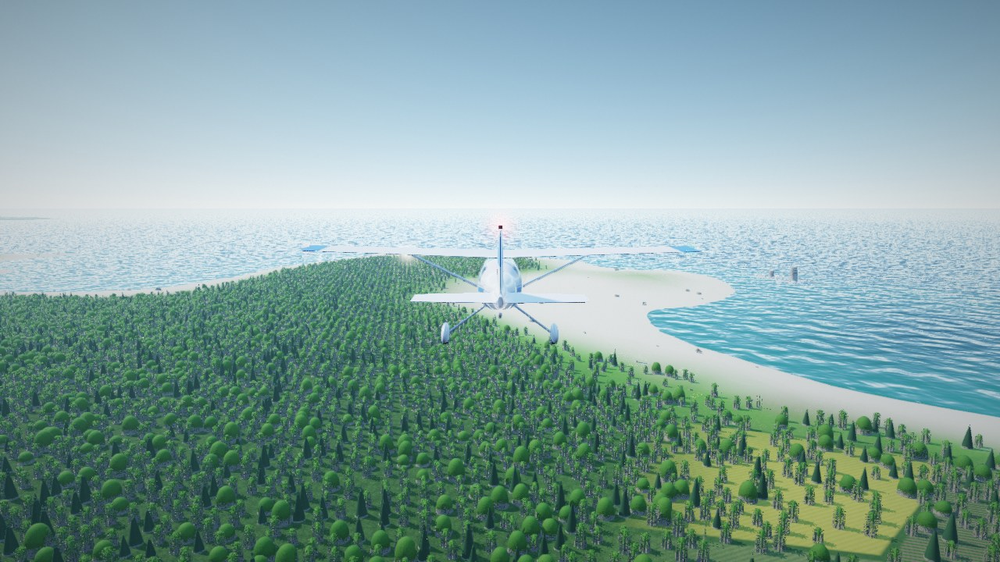 | |

## Features

- **Ray-traced renderer.** The terrain, ocean, sky, clouds and aircraft are traced on the GPU: an eroded heightfield over 80 × 80 km, an ocean with Fresnel reflections, volumetric clouds, soft terrain and aircraft shadows, an analytic sky with golden hour and night, and SDF aircraft with moving flaps, ailerons, elevator, rudder, gear and props. Triangle meshes do the searching: a terrain "envelope" mesh that lies just above the exact ground everywhere, and for each light aircraft a closed hull mesh built at startup from its own shape (holding it in every position of its gear, flaps and controls), are rasterised first, so each pixel's exact march starts right at the surface, and pixels they miss skip that march altogether. The surface you see is still the exact shape with all its detail, so nothing is lost and no seam can open. A conservative max-height mip pyramid lets the remaining terrain rays skip empty air in big jumps. The trees, rocks and buildings are instanced meshes rasterised into a G-buffer that the ray tracer reads, so they get the same sun, sky, terrain-shadow, cloud-shadow, fog and TAA treatment as everything else. They also cast sun shadows of their own through two cached shadow cascades, which fade smoothly with distance around the camera, so shadows never pop in as the maps update. Every light but the sun and moon is a point or spot light with ray-traced shadows from the aircraft, and each sits in a modelled fixture with a housing and a domed lens. This covers the nav lights in the wingtips and tail cone, strobes flashing through the wingtip lenses, a red beacon on top, landing lights in the wing leading edges and the exhaust flames, on your aircraft and on all traffic. Airports have real lighting fixtures too: runway edge lights (amber over the last 600 m), green and red threshold bars and approach lights, each a stalk with a glass globe that casts a small pool of light on the pavement, and PAPI units whose lenses turn from red to white as you climb through each unit's glide-slope angle (worked out per pixel from your actual eye height). From further out they're pixel-sized glints that the bloom spreads. A physically based mip-chain bloom gives every bright source a soft, lens-like halo without washing the image out, and light shafts fan out from a low sun through gaps in clouds, terrain and the airframe. The clouds are volumetric cumulus: flat bases, billowing tops eroded into wisps at the edges, self-shadowed by a light march towards the sun, with silver linings, multiple scattering inside and the powder darkening of thin edges. Aerial perspective gives the scene depth: Rayleigh scattering turns distant hills blue and drains their contrast, and a low haze layer (following the weather's visibility) thickens near the ground and glows around the sun.
- **Detailed aircraft.** Each of the 7 aircraft is hand-built, down to riveted skin panels, door outlines and handles, fuel caps, a pitot tube, static wicks and antennas. Fuselages are shaped from 8 cross-sections, and wings and tails are tapered airfoil sections with sweep, dihedral and winglets. Flaps (with rearward Fowler travel), ailerons, elevators and rudders are separate hinged parts. You'll also see wing struts, STOL slats, engine cowls, exhaust stacks, turboprop and jet nacelles with fan faces, a cargo pod, wheel fairings, tundra tyres, twin-wheel retracting gear, a steerable nose wheel, antennas, nav lights and liveries with window frames.
- **3D cockpits.** You sit in a detailed cockpit with live gauges (airspeed, attitude, altimeter, turn coordinator, heading, VSI, RPM/N1, fuel) in raised bezels, or glass PFD/ND screens and a centre engine display on the jet and airliner. There's a lit radio stack, eyeball vents, a centre pedestal with trim wheel and fuel selector, throttle, mixture and flap levers, metal yokes with rubber grips, toe-brake pedals, bolstered seats with harnesses on seat rails, trim panels with armrests and door handles, and an overhead console. Every frame the gauges and display pages are drawn into a high-resolution texture (each research-jet page at 512 px; the light-aircraft panel at about 3,500 px per metre) that the ray tracer samples with mipmapped filtering, so the screens stay crisp and stable at any size or angle, and the gauge code stays out of the main ray-tracing shader. They are drawn as anti-aliased vector art, supersampled, with a proper font for every numeral and label: airspeed arcs (flap, normal, caution, never-exceed), an altimeter with three hands and a digital drum, a numbered pitch ladder and bank scale, a rotating compass card, a turn coordinator with its slip ball, and a radio stack with lit LCD frequencies. The glass cockpits get scrolling speed, altitude and heading tapes with readout windows. The research jets' display pages (engines, power, map, attitude, thrust vectoring, g / AoA, nav) are drawn the same way, so they stay sharp at 1080p and above. Strokes never get thinner than a pixel and a half, and the image sharpening skips display glass. In the cockpit view the mouse wheel (or holding **U**, rebindable) zooms in, so you can lean in and read any display. Everything moves with your inputs and uses PBR materials (brushed metal, rubber, leather or cloth, carpet, fabric headliner). Sunlight falls through the windows; at night a glareshield LED strip floods the panel and a dim amber dome light glows overhead, all from modelled light fixtures. In the cockpit view the outside world is only traced through the windows.
- **Correct control movement.** Every control surface, plus the nose or tail wheel, moves in the same direction as the input and the aircraft's actual response. A test (`tests/flight_test.cpp`) checks this for every aircraft.
- **Living world.** The terrain is a smooth heightfield (39 m base grid, filtered so big landforms have no faceted creases) with detailed ground textures (grass, leaf-litter forest floor, rock, sand, snow, farmland, roads). Everything standing on it is a separate entity: 7 kinds of tree (fir, spruce, Scots-style pine with tufted branch whorls, oak, birch, palm and bush) picked by climate and altitude, with bark, leafy crowns of alpha-cut leaf sprays that sway in the wind, and needles that take snow. Rocks come as boulders, blocks, slabs, mountain outcrops, sandstone spires and stratified sea stacks. 17 kinds of building fill 18 hand-placed settlements, from two cities with glass towers, setback towers and apartment blocks, to towns of shops, townhouses, churches, water towers and gas stations, and villages of gabled, hip-roofed and L-shaped houses with gardens. Farmsteads with barns, silos and machine sheds sit in the fields, and a lighthouse with a turning lamp stands on Lighthouse Key. Patchwork farmland has crop rows, wheat, ploughed soil, rapeseed, vineyards, wildflower meadows and hedgerows. Windows, shop fronts, signs and canopies light up at night, and a hand-drawn road network with lane markings links the towns. All of it is solid: fly into a tree, a rock or a building and you'll crash. Plasma blasts flatten whatever stands in them.
- **Airports.** Every airport is laid out like the real thing, to its size. International hubs have a parallel taxiway with exits, a big concrete apron with gates where airliners sit nosed in to a glass terminal on jet bridges, freighters at the cargo sheds, GA tie-down rows, maintenance hangars, a tall control tower, a fuel farm, a radar dome, floodlight masts, car parks full of cars, and a perimeter fence around it all. Regional airports scale that down: a terminal with a turboprop or regional jet on the apron, T-hangar rows, a flight centre, a fuel farm and bowser. The small strips each have their own character: a farm strip with its barn and silo, a mountain rescue strip, a volcano observatory with a radome, a polar research station, an island club field, each with a Quonset or steel hangar, a club house, a fuel pump, parked aircraft and windsocks that stream with the wind. Navigation aids stand where they belong (ILS localizer arrays beyond the runway ends, glide-slope masts beside the touchdown zones, rotating green-and-white aerodrome beacons). Runways get concrete slabs or grooved asphalt, painted runway numbers and blast-pad chevrons; taxiways get yellow centre lines, edge lines and holding-position markings at every exit, blue edge lights at night, and aprons get stand lead-in lines, stop bars, tie-down markings and floodlit pools of light. AI traffic parks on those stands and taxis on those taxiways.
- **PBR materials.** 30 tileable PBR texture sets (albedo, roughness, normal, height, AO) are generated at startup. They cover terrain (including leaf-litter forest floor), buildings (concrete, clay tiles, slate, asphalt shingles, plaster, brick, lap siding, wood planks, corrugated metal), vegetation (bark, leaves, needles, crops, wheat) and aircraft (paint, brushed metal, tyre rubber, cockpit plastic, seat fabric, leather, carpet). They're lit with GGX/Cook-Torrance shading, triplanar on cliffs, and darken and get glossier in the rain.
- **Air traffic.** The sky is busy. At the airports around you, aircraft park on the apron stands, taxi along the yellow lines with spacing, hold short, take off, fly a full circuit (crosswind, downwind, base, final), land on a glideslope, roll out, taxi back to their stand and go again. Arrivals join the downwind leg and are sequenced behind each other, some departures leave the area, and everyone holds or goes around if you're on the runway. Cruising traffic crosses the map at altitude. Every couple of minutes a formation of two or three XR-9s rips past at 400 m/s in reheat, sonic booms and all, before pulling up into a climbing roll. A two-ship Kestrel display team flies loops, rolls, barrel rolls, Immelmanns, split-S, Cuban eights, four-point rolls and hammerheads with white and red smoke over the nearest airport. All traffic is ray traced with the full aircraft models, casts soft shadows, shows nav lights, beacons, strobes and landing lights at night, and can be switched off in Settings (*Air traffic*). Watch out: a mid-air is fatal.
- **Close encounters.** Every so often, when you're well clear of the ground, something swoops in from behind and settles alongside. Watch the hatch.
- **Crashes.** Explosions are layered: a white-hot flash that lights the scene, a fireball whose flames cool from yellow to deep red as they billow and rise, a smoke column that keeps climbing and spreading, arcing sparks, burning fragments trailing fire and smoke, and a shock ring, with secondary blasts as the fuel goes up. On impact the aircraft breaks into its nose, centre section, both wings and tail. Each piece is a separately simulated rigid body that tumbles, bounces and comes to rest, blackened and burning with glowing embers at the breaks. Skin fragments scatter around the site. The impact blows a crater into the ray-traced terrain with a scorched blast ring and smouldering embers, flattening the trees and buildings around it, and the camera orbits the wreck. Overstress an airframe in flight and it rips apart in the air: the tanks flash into a fireball smeared along the flight path, torn skin and fuel mist stream away, and the pieces go off again one after another, each falling piece streaming a flame jet and a continuous smoke trail. They keep their momentum, tumble out of the sky trailing fire and black smoke, and each one smashes into the ground (or the sea) where it falls, with the centre section digging the crater. Crashing into water throws spray; the pieces float for a moment, then sink to the seabed trailing bubbles, and the skin fragments flutter down after them.
- **Effects.** Tyre smoke, dust and snow spray from unpaved strips, prop-wash dust, wingtip vapour that streams off every aircraft's tips in continuous ribbons (widening and thinning as it ages), engine-start smoke puffs, crash fire and smoke, rain streaks, snowfall, raindrops on the lens, lightning, bloom and lens flare. Lighting includes runway edge, threshold and approach lights, working **PAPI** lights, plus nav, strobe, beacon and landing lights that light the terrain.
- **Engine sound.** All audio is synthesised in real time. Piston engines are modelled one cylinder at a time: each firing excites exhaust resonators, and slight differences between cylinders give the uneven idle and crank-rate rumble. On top of that is a prop blade-pass buzz and whoosh. Twins run two engines slightly out of sync so they beat against each other. Turboprops and jets get their own whine, roar and buzz-saw models. The cockpit view filters the sound, and you'll also hear a starter motor, wind, runway seams, tyre chirps, stall horn or stick shaker, gear and flap motors, rain and thunder.
- **GPS moving map (N).** An animated, north-up moving map centred on your aircraft, over aerial imagery rendered on the GPU from the real terrain (the same materials you fly over: forest canopy, fields, beaches, rock, snow, roads, runways and shallow-water colour, hill-shaded like a satellite photo). It shows the route with flowing dashes, checkpoint markers, runways drawn to scale, your breadcrumb trail, predicted position at 1, 2 and 5 minutes, a fuel-range ring and a radar sweep. A side panel lists next waypoint, distance, bearing, ETE, ETA, route remaining, ground speed and track, fuel range against the remaining route, destination runway and wind, and the nearest airport.
- **Checkpoint gates.** Animated holographic gates with counter-rotating segmented rims, sweeping highlights, inward pulses and sparks drifting around the rim. A trail of moving lights leads to the next gate, and flying through one sets off a shockwave and a shower of sparks.
- **Clean glass UI.** Menus and HUD panels use a consistent glass style with cyan accents and corner brackets. Buttons, cards, tabs and sliders respond to the mouse with animated glow, sheen and press feedback.
- **Voices.** A cast of six speaks over your headset: Cal Morgan, your instructor in the first lessons; examiner Rosa Vance on the checkride; Ellis Park with the airport and weather information; Finn Mercer of the Spectre display pair; Aster, the cockpit assistant, with checkpoints, lever settings, landing ratings, warnings (stall, pull up, gear, engine off) and outcomes; and Nyx, the research computer. Each line plays when the game shows its message, from one comms channel: the most important call first, warnings cutting in, a newer lever setting replacing one still waiting, each lesson hint once, and nothing stale after a pause, a crash or the end of a flight. Lesson hints recorded with gamepad button names play only when you fly with a gamepad.
- **Tower controllers.** Recorded voices on the radio, with a squelch click before each call and a squelch tail after it. Each airport with a tower keeps one of three controllers (North, Coast and Valley Tower); the small strips (farm, island, mountain and glacier strips) are uncontrolled and silent. They speak only from what is actually happening: a greeting when you start at an airport, your takeoff clearance for the runway you're on with the real wind, a handoff to departure once you're clear of the field ("remain in the pattern" on circuits), straight-in or left-downwind joining instructions as you come into your destination, the landing clearance once you're established on final, and "exit the runway when able" on the landing roll. Climb away after the clearance and you get a fresh approach call. They call you by the registration painted on your aircraft (SX- and three letters, one per aircraft type): in full on first contact with each tower ("Sierra X-ray Alfa Bravo Charlie"), then abbreviated ("Sierra Bravo Charlie"). The AI traffic at the field is part of the exchange: you hold for an aircraft on final or on the runway before your takeoff clearance, you're told you're number two behind an aircraft ahead on final (with a wake turbulence caution behind a much heavier one), the landing clearance waits while the runway is occupied, and an aircraft still on the runway as you reach short final means a go-around. Each call is also shown on screen, and calls never play after a pause, a crash or the end of the flight. Settings has a voice volume, and the radio music and engine dip while someone is talking.
- **Muffle button (M).** A headset-style noise filter that turns down engine, wind and rolling noise for relaxed cruising.
- **Live internet radio (R).** Streams MP3/AAC stations through Windows Media Foundation. You can add your own stations.
- **Flight model.** Six degrees of freedom with stall and wing drop, flaps, ground effect, prop wash, density altitude, wind shear near the ground, gusts and turbulence, spring-damper gear with steering and brakes, and taildragger handling. The aerodynamics come from each airframe's shape (`src/aero.cpp`): the drag is built up part by part (fuselage from its length and width, wing and tails from their area and thickness, nacelles, struts, landing gear sized by weight, engine cooling, rivets and antennas), with skin friction that changes with speed, altitude and size the way a real aircraft's does; the lift slope and span efficiency come from the wing's aspect ratio; weight sets the induced drag; the wing's drag rises near its critical Mach number, and a sideslip or high angle of attack pushes the fuselage broadside through the air. Cruise speed and climb rate come out of that, nothing is tuned to hit them. Includes time acceleration in cruise and a full autopilot (see below).
- **Autopilot and autoland.** Press **Z** for heading, altitude and speed hold: rolling turns the heading bug, pitching moves the altitude target and the throttle sets the speed (a number key hands the throttle back to you). Pick an airport on the GPS map (click it, or Tab / D-pad, then **ENGAGE AUTOLAND** or Enter) and the autopilot flies you there and lands. It picks the runway end from the wind and the terrain, cruises above the high ground, descends in an orbit over the lowest ground near the approach, intercepts the localizer and a glidepath that steepens where hills demand it, sets flaps and gear, flares, brakes to a stop and sets the parking brake. If it isn't stable on final it goes around and tries again. The XR-11 Wraith comes to a hover over the runway and lands vertically. The autopilot flies every aircraft to its own limits: it learns each type's envelope by flying it (stall speeds, climb, roll rate, how hard and how fast the airframe answers the controls) and then turns at up to 75-85 degrees of bank and pulls as hard as the structure takes, less a margin for gusts, with no other limiter. On career flights it flies for the passengers and the load instead: up to 25 degrees of bank, 0.8-1.3 g, gentle roll and climb rates (aerobatics and the research jets keep the full envelope; your own stick is never limited). The GPS draws the planned approach, the HUD shows an autopilot banner, and time acceleration stays available while it's en route. Any stick input hands control back.
- **Hand-designed world.** "The Solace Islands" has 16 airports on 5 islands: a flight-school field, grass farm strips, a rock in the sea, international hubs, a 5,400 ft gravel mountain pass, a volcano research strip, a glacier snow runway, a fjord town and a remote resort isle. Every approach has a cleared glide corridor.
- **Career.** There are 4 lessons and 30 story contracts in 5 chapters (Student → PPL → CPL → Owner-operator → ATP), plus endless freelance jobs. Work includes cargo, passengers, fragile loads, medevac with deadlines, VIP charters and a scenic tour. You're scored on landing softness, passenger comfort (bank and G), deadlines and fragile-cargo handling. You can rent at any airport, buy and sell 7 aircraft, and pay for ferry flights and positioning tickets. The job board quotes each job for the aircraft you pick: it flies the job on the autopilot in the background and shows that time and fuel (with its uncertainty), the payment, the operating costs and the net, the deductions that apply and the main challenge, and the debrief charges exactly the fees it quoted; clients pay a reliable pilot more (up to +15% with reputation). The debrief gives one coaching point from your arrival: speed and height over the threshold, where you touched down and how much runway was left. During a flight the latest tower instruction stays readable beside the navigation card.
- **No softlocks.** The campaign is checked automatically (`tests/progression_test.cpp`). Every contract is flown with an aircraft you can rent or afford, fuel range (with reserve), runway length (corrected for elevation), surface type and deadlines all fit, and the money curve needs only light freelancing or selling an old plane. Rentals never require cash up front, and if you're broke you get free courtesy rides.

## Aircraft

| Aircraft | Type | Seats / Cargo | Range | Runway | Licence |
|---|---|---|---|---|---|
| Kestrel T2 | 2-seat trainer (4-cyl) | 1 / 120 kg | 45 km | 400 m | Student |
| Wren 180 | 4-seat tourer (6-cyl) | 3 / 320 kg | 70 km | 450 m | PPL |
| Bushmaster STOL | Taildragger bush plane | 4 / 480 kg | 60 km | 220 m, gravel/snow | CPL |
| Islander Twin | Twin-piston utility | 9 / 900 kg | 90 km | 420 m, gravel/snow | CPL |
| Pelican Caravan | Single turboprop | 12 / 1,400 kg | 130 km | 550 m, gravel/snow | CPL |
| Meridian Q400 | Twin-turboprop airliner | 40 / 4,500 kg | 170 km | 1,100 m paved | ATP |
| Starling 500 | Twin-jet business jet | 7 / 700 kg | 260 km | 1,250 m paved | ATP |

## Controls

The game shows no key prompts during flight. Open **Controls** from the main menu, the pause menu or the Settings tab to see every binding. To remap one, click its keyboard or controller cell and press the new key or button (Esc / Menu cancels, right-click clears the binding). A key that's already used in the same group swaps over, and **Reset to defaults** restores the table below. Bindings are saved in `settings.cfg`. The arrow keys, PgUp / PgDn, the number keys, the sticks and the triggers are fixed.

| Key (default) | Action | Gamepad (default) |
|---|---|---|
| W / S or ↑ / ↓ | Pitch down / up | Left stick |
| A / D or ← / → | Roll | Left stick |
| Q / E | Rudder / nosewheel | LB / RB |
| Shift / Ctrl, PgUp / PgDn, 1–9, 0 | Throttle | RT / LT |
| F / V | Flaps down / up | B / X |
| G | Landing gear (retractable aircraft) | Y or D-pad → |
| B | Parking brake (set / release) | D-pad ← |
| Space | Wheel brakes | A |
| [ / ] | Elevator trim | D-pad ↑ / ↓ |
| Z | Autopilot: hold, or autoland at the airport picked on the GPS | Right-stick click |
| ; | Aerobatics: the autopilot flies the next figure (loop, aileron roll, barrel roll, Immelmann, split-S, Cuban eight, wingover); press again to stop and level off | (bind one in Controls) |
| T | Time acceleration ×1 / ×2 / ×4 (cruise only) | |
| C | Camera: chase, cockpit, orbit, flyby (chase and orbit stay where you swing them) | Back |
| Right mouse drag, wheel | Look around, zoom | Right stick |
| L | Landing lights | |
| I | Engine restart | |
| **M** | **Muffle engine noise** | Left-stick click |
| Tab | Toggle minimap (hidden by default); with the GPS open, pick the autoland airport | D-pad ← / → on the GPS |
| **R** | **Internet radio** | |
| **N** | **GPS moving map** (mouse wheel or the on-map buttons zoom) | |
| H | Toggle HUD | |
| Esc | Pause menu (restart, settings, abandon) | Start |
| F11 / Alt+Enter | Fullscreen | |
| F3 | Performance readout (fps, GPU time, resolution) | |
| Enter / Space (after a crash) | Skip the crash sequence | A |

Pull g and the edges of the screen take on a faint red tint that slowly closes in, deepening to dark red and then black as the load approaches what the airframe can take (from about 1.8 g in regular aircraft; negative g reddens them too). The XR-9's damped cell starts at 4 g and only reaches the full ring near 50 g.

On a gamepad, holding both bumpers (LB + RB) for a second hides the whole flight UI for a clean view; do it again to bring it back.

Menus work with the mouse or a gamepad. On a gamepad, the left stick (or D-pad) moves an on-screen cursor, **A** clicks, **B** backs out (like Esc), and the right stick scrolls lists. Moving the real mouse hands control straight back to it.

<details>
<summary>Classified (spoiler)</summary>

Can't wait for a close encounter? Hold **J** and **K** together for a second while flying and they'll come to you.

Bored on a long leg? Hold **O** and **P** together for a second while flying and the **Spectre display pair** joins you: two XR-9s in red-and-gold and blue-and-white livery, trailing coloured smoke. They fly a show around you all the way to your destination: synchronised rolls in formation, a double helix around your flight path, a head-on knife-edge crossover with a fly-by roar, synchronised loops off your nose, and a split-and-cross with one high and one low. The radio calls each act. Hold O + P again to send them home; they also rock their wings and pull away in reheat when you settle onto an approach.

Hold **U** and **I** together on the main menu, or click in **both sticks** on a gamepad, to open the Project NIGHTGLASS research terminal. It opens with a biometric check (a fingerprint ridge scan, a retinal scan and a cortical-resonance match; click, Enter or A skips it, and it's only played once per session). The terminal lists both airframes as cards and shows the chosen one as a live ray-traced 3D preview hanging over the selected launch site, in that sortie's light and sky: drag it to turn it, use the wheel to zoom, and callouts point to its real parts. The specification decrypts beside it with a manoeuvre envelope chart. From there you can fly the **XR-9 Specter**, a supersonic research jet, for free from any airport, starting airborne or on the runway, in clear, overcast or stormy weather.

- **Performance:** full reheat doubles the thrust, for a thrust-to-weight ratio of about 4.4 and Mach 2.5 at 3,000 m. Just below Mach 1 in humid air a volumetric vapour cone forms around the airframe: a sharp edge at the shock and a streaky, sunlit shell that fades aft. Breaking Mach 1 sets off a sonic boom.
- **Take-off and landing:** a conventional runway jet with no flaps, landing fast on its cranked delta wing at about 140 kt.
- **Handling:** the 2D nozzles vector ±29° for pitch. There are no g or angle-of-attack limiters: the stick commands rotation directly, around 230°/s of pitch at Mach 1 and 315°/s of roll. The airframe fails beyond +50 / −25 g, and a full pull much above Mach 1.5 will tear it apart.
- **Exhaust:** ray-marched plumes. In dry thrust a blue core grows longer and brighter with the throttle, an orange-tipped flame shows from mid power, and pale shock cells form near full military power. From about 70% spool, reheat phases in and lights a translucent blue-violet shell at the nozzle, a train of white-yellow shock diamonds spaced wider as Mach climbs, and an orange flame that flares, flickers and reddens downstream, dense enough to dim what's behind it. Reheat sheds a few motion-blurred embers, and lighting it flares a shock ring. Each nozzle holds a shadow-casting light, so the flames light the nozzle rims and the ground, and the nozzle walls throw a shadow across the fuselage between them.
- **Nozzle internals:** behind each 2D nozzle's convergent-divergent flaps sit afterburner spray bars, two flame-holder rings, a ribbed soot-black liner and the last turbine stage with its tail cone. They glow dull red at idle and orange-white in reheat.
- **Cockpit:** a sealed pod with no windows. You fly on a panoramic display fed by three cameras in the nose, with a full HUD (pitch ladder, flight-path marker, heading tape, speed, altitude, Mach, G, thrust-vector angle and throttle), with annunciator lights above it. A curved instrument console holds five displays: engine gauges, power bars, a live heading-up terrain map, an attitude indicator and the thrust-vectoring page (nozzle angle, gear and reheat). Side consoles carry a G-meter and angle-of-attack page, a compass page and backlit keypads, with an overhead switch panel above. Side displays show the left and right cameras. The pod is kept low-lit, only by its own modelled fixtures: the displays, two warm recessed ceiling light bars, cyan LED strips and an amber footwell light. Its carbon, composite, leather, rubber and webbing surfaces use PBR materials.
- **Sound:** a layered voice with a warm harmonic core whose pitch rises with power, fan whine, deep sub-bass, an exhaust roar that opens up with thrust, a crackling afterburner and a deep, low double-thump sonic boom with a long rolling rumble.
- **Career:** these flights don't count towards the career or the logbook.

The same terminal has a second airframe (click the **XR-11** card, press Tab, or gamepad X): a stealth aerobatic research craft built for insane speed and g.

- **Airframe:** an angular, faceted stealth body with sharp chines, caret intakes, a faceted gold canopy, a diamond wing with a forward-swept trailing edge and elevons, and canted all-moving ruddervators. The skin is a PBR radar-absorbent coating with sawtooth panel seams. Its two landing lights sit under the chin, ahead of the pods, turrets and gear, so nothing blocks their beams.
- **Cockpit:** a faceted sealed cabin of hex-tiled composite panels between titanium ribs, wrapped in angular camera displays: each pane shows the picture of its own camera on the airframe, looking out the way the pane faces. There's a three-pane front wrap with an angular cyan HUD, tall side displays with aft displays behind them, an overhead pane, a sloped chin pane under the dash, and a glass floor in the footwell crossed by a titanium grid, with the rudder pedals over it. Two more floor panes sit beside the seat. Look down and the belly cameras show the ground below, with trees, buildings and the bombs going off. Every display brackets the UFO in violet with its range when the visitors arrive. They swoop in from the rear quarter, in view of the aft displays. The HUD shows a laser pipper at the turrets' convergence point (red when they're out), a violet cloak arc, speed, altitude, heading, Mach and g. The floor and chin panes show where a bomb released now would land, with its blast ring and range. When a bomb drops, a separate bomb camera is spawned: it chases the bomb down from just behind, then flies out to a vantage point about 400 m away to watch the blast from a three-quarter angle, slowly orbiting it, and is removed once the blast has burnt out. While it exists the floor screens show its picture instead of the belly cameras'. The angular dash carries two displays, a row of weapon and system annunciators and a projector with a spinning holographic globe. Side consoles have touch glass and displays, an angular throttle and a side stick with lit triggers; there's a fighter seat in hex-quilted hide with glowing headrest slits, an overhead switch rail, emitter strips along the cabin edges and glowing bulkhead vents. The displays light the cabin with whatever they're showing.
- **Camera displays (both research jets):** every display is a monitor for a real camera, an object fixed to the airframe at the point where its line of sight leaves the skin. Each camera renders the full scene from where it sits (terrain, trees and buildings, traffic, weapons, clouds, smoke, fire, sparks and the other particle effects, light shafts, and your own aircraft when it's in shot) into its own picture. Every camera whose display you can see renders a new picture every frame; one turned out of view keeps its last picture and is updated the moment it comes back into view. The HUD symbology is drawn conformal to each camera's view.
- **Four thruster pods:** two on short pylons beside the nose and two in nacelle wells at the wing roots. Each turns on a rotating mount: a bearing housing on the pylon or on both walls of the well, a trunnion shaft and a flanged hub with a bolt circle that turns with the tilt. The pods swing clear of the airframe at every angle, and the canted tail fins root into the fuselage. Each pod is modelled in detail: a faceted nacelle with a sawtooth intake lip, a spinning 14-blade intake fan, a glowing turbine core, an iris nozzle whose petals open with thrust, three pitch vanes and two yaw vanes in the jet, the tilt trunnion, and a hydraulic actuator whose rod extends as the pod tilts. **F / V** tilts all four pods from thrust-aft (forward flight) to straight down (hover). Each pod's thrust is applied where the pod actually is, so the hover is held up by four real jets.
- **Flight control:** the fly-by-wire turns stick input into the rotation it wants, then works out how to make it. It uses the elevons and ruddervators first (their authority grows with airspeed), then the pods: thrust front against rear and left against right, the pitch and yaw vanes, and tilting the left and right pods differently. Whatever it can't make simply doesn't happen, so slow and low on power the controls go soft, just as they would on a real tilt-jet.
- **Performance:** about 2.2:1 thrust-to-weight dry and 4.6:1 with boost (above 85% throttle), Mach 3.6 at 4 km, a 400°/s roll, and about 80 g at full stick at high speed. The airframe holds +90 / -45 g.
- **Cloak (X, or double-tap gamepad A):** the cloaking field spreads from the nose to the tail in a violet wavefront. Once it has, the craft is almost invisible: you see the terrain and sky through it, slightly distorted, with only a faint glassy rim and a shimmer of the emitter lattice. Its shadow fades and its lights go dark. Inside cloud or haze the field blends into the murk around it too.
- **Weapons hot (Y, keyboard or gamepad):** the laser turrets drop out of hatches in the forward chines and the bomb bay doors open. Each flight starts with the weapons stowed. Press Y again for weapons safe: the bay closes and the lasers stow. While weapons are hot on a gamepad, **RB fires the lasers** and **LB drops a bomb**, and the rudder is frozen until you go safe again. On the keyboard, hold left mouse or Enter to fire (this goes weapons hot by itself) and press Backspace or middle mouse to bomb.
- **Lasers:** alternating crimson pulse bolts that leave the turret tips at 2,000 m/s on top of the Wraith's own speed (so they always streak away from the lenses, even at Mach 3) and converge 650 m ahead. They fly out to 4.5 km and bring down any aircraft they hit. Each bolt that strikes the ground digs a small scorched crater. Trees, bushes and boulders go up in one hit; buildings and big rock formations take more the bigger they are (a house takes about 3, a skyscraper 12) before they're destroyed in fire, sparks and a column of smoke, leaving a scorched pit where they stood.
- **Plasma bombs:** unlimited. The belly bay's clamshell doors open, the dark-energy bomb drops from its cradle and a new one condenses in its place. Each bomb is a black sphere crawling with violet plasma. On impact it goes off in a blinding white-violet flash, with a condensation dome racing outward and a shock ring tearing across the ground. A turbulent white-hot fireball laced with cyan filaments swells, lifts off and rolls up into a violet mushroom cap on a glowing stem, then slowly cools into a towering column of dark smoke. Glassed fragments and clods of earth arc out of the blast, a ring of dust rolls out along the ground beneath the cloud, and the boom is deep and imploding. The bomb camera pulls back as the cloud climbs. It leaves a crater of fused black glass with violet embers in the cracks, and nothing nearby survives it.

</details>

## Flying tips

- Fly the green rings in the lessons. The navigation card at the top shows distance, bearing, how far to climb or descend and time en route; the heading tape below it has a magenta caret on your target's bearing with a turn cue. The magenta diamond sits on the objective itself in 3D, with a dashed stalk down to the ground so you can read its height, and turns into an arrow at the screen edge when the target is out of view.
- The wind dial (left) shows the wind at your aircraft relative to your nose, its direction, speed and gusts, and the headwind / crosswind components (amber when the crosswind is strong).
- On approach the HUD shows a glidepath (G/S) and localiser guide. The PAPI lights by the runway show **two white and two red** when you're on a 3° glidepath.
- A touchdown under 150 fpm earns a "butter" bonus. Over 600 fpm costs you, and over about 900 fpm collapses the gear.
- High and hot airfields need more runway. Summit Pass (5,400 ft) only works in a STOL aircraft.
- Check the range shown on the engine panel before long crossings.

## Internet radio

Press **R** in flight, or use the **Radio** button in the hub. Stations come from `%APPDATA%\SolaceExpress\radio_stations.txt`, which is created on first run. Add one line per station:

```
My Station|https://example.com/stream.mp3
```

Any MP3 or AAC stream over HTTP or HTTPS that Windows Media Foundation can play will work.

The presets include SomaFM, Radio Paradise and KEXP, plus free US East Coast public and college stations: WNYC and WQXR (New York), WFMU (Jersey City), WBGO (Newark), WFUV (New York), WXPN (Philadelphia), WBUR, GBH and CRB (Boston), WMBR (MIT), WUNC (Chapel Hill) and WCPE (Raleigh). When an update adds presets, they're appended to your existing station file, and your own stations are kept. The list scrolls with the mouse wheel.

## System requirements

- Windows 10 or 11, 64-bit
- A GPU with OpenGL 3.3 (anything from roughly 2012 on). A mid-range GPU from the last 5–6 years is recommended for 1080p.
- **60 fps.** The game runs locked to 60 Hz: vsync on 60/120/240 Hz displays (adaptive where the driver supports it, so a late frame tears once instead of dropping to 30), and a precise frame limiter on other refresh rates.
- **Scenery streaming.** Scenery is generated deterministically in 256 m chunks as you fly (about half a millisecond per chunk, nearest first). Chunks within 700 m are built immediately; the rest are built on background worker threads (one per spare CPU core) and handed to the renderer when ready, so streaming costs the frame almost nothing. Each object has three levels of detail picked by distance. Chunks are frustum-culled, trees thin out towards the draw distance where the ground's canopy texture takes over, and the shadow cascades only re-render when the camera has moved far enough or new scenery appears where their shadows show. In cockpit views, the area the cabin covered last frame is masked out before the scenery is drawn, so trees and buildings behind the cabin walls are never shaded, and the terrain's shadow on the aircraft is computed once per frame on the CPU rather than for every pixel of the cabin. The Low/Medium/High quality setting scales the tree, rock and building draw distances (trees out to 2.6 / 4.5 / 7 km, buildings to 9 / 13 / 18 km, scenery shadows reach about 2 / 3.2 / 4.4 km ahead) and the shadow-map size.
- **Resolution.** By default (*Auto 60*) the ray-trace resolution drops automatically, down to 50%, only while the GPU can't hold 60 fps, and climbs back in 5% steps when it can. Settings → *Render resolution* can instead fix it at 100 / 85 / 75 / 67%. The temporal AA upscales back to the display either way. The display is paced to 60 Hz (vsync on 60/120/180/240 Hz monitors, a precise limiter otherwise). Temporal anti-aliasing smooths edges, and a light contrast-adaptive sharpening pass keeps the image crisp. Press **F3** for a frame-rate / GPU-time / resolution readout with the GPU time of every rendering pass. An FPS counter is always shown at the top right. `benchmark.bat` (next to the exe) times several scenes at 1080p and at your desktop resolution and writes `bench_1080p.txt` / `bench_native.txt`. `profile.bat` renders a few scenes with each ray-tracing feature (clouds, terrain shadows, scenery shadows, aircraft shadow, point lights, cloud shadows, terrain march, terrain materials, fog) switched off in turn and writes what each one costs on your GPU to `profile.txt`. The pre-flight loading screen shows a picture of the airport (or of your aircraft in flight); the game ships with a set in the `loading` folder, and `render_loading.bat` renders fresh ones on your GPU (your renders take priority). `render_menu.bat` renders the main menu's montage (the whole 128-second loop of eight shots, every frame complete, at 1920x1080 and 30 fps) into `menu.mp4` next to the exe; when that video is there the main menu plays it instead of ray tracing the montage live, so the menu runs at full frame rate. `analyze.bat` is the thorough version: for eight scenes it splits each frame into CPU and GPU time, measures every rendering pass exactly, times the frame at 100 / 85 / 75 / 67% render resolution (to show whether per-pixel work is the bottleneck), measures each ray-tracing feature, and counts the ray tracer's work per pixel (terrain samples, aircraft shape samples, cloud steps, effect and light steps) with heat maps. It writes `analysis.txt` and an `analysis` folder of images. Low/Medium/High quality is in Settings.

**Before each flight** a loading screen shows an aerial image of the departure airport (or, when you start in the air, the airport you're heading for) with the mission, route, aircraft and weather, while the scenery around the start is generated. Once everything is in, it fades into a live shot of your aircraft on the runway or in flight, and you start when ready, so nothing pops in when the flight begins.

**Main menu.** Behind the menu the game tours the islands live: every 16 seconds a different place, aircraft, time of day and camera (Port Verde's coast in the morning, an XR-9 past the volcano at sunset, the Palm Bay lagoon, the Spine mountains, Solace Capital at dusk, the fjord, Lighthouse Key at dawn with the XR-11, Meadowbrook's farmland).

**Startup.** The first thing on screen is the intro: the game's icon in a rotating ring, the title and a progress bar. The intro animates on its own thread with its own OpenGL context, separate from everything else, so loading never freezes it. The first time a new version starts, the shaders are compiled by a hidden helper copy of the game (graphics drivers can stall every other drawing call of the process doing a big compile), which writes them to the shader cache; the game then loads them from there. While it plays, the shaders load on a worker thread with another context and the world is generated on another thread (its heightmap, scenery masks and the terrain textures are split across every CPU core), so the screen keeps animating at 60 Hz. When both are done, the menu tour's first place is loaded (every tree and building in range, the shadows) and every aircraft's hull is built, rendered offscreen while the intro still plays, so the menu opens complete. During the menu tour the next place loads in the background while the current one plays.

Save data, settings and the radio list live in `%APPDATA%\SolaceExpress`. Compiled shaders are cached in a `shadercache` folder next to `SolaceExpress.exe` (or with the save data if the game folder is read-only): the first launch compiles them, later ones load the driver's binaries in a moment. A game update, driver update or different GPU simply rebuilds the cache.

**Performance.** The cloud and terrain noise fields are baked at startup into tileable textures (a 1024² coverage map and a 128³ noise volume), so the GPU samples them with its texture hardware instead of evaluating hashed noise per sample; the cloud march takes long strides through clear air and half the steps for water reflections. Scenery chunks that lie wholly in one level of detail are handed to the GPU in one block, and the vertex shader does the distance thinning per instance.

**Laptops with two GPUs.** The game asks NVIDIA Optimus and AMD switchable graphics for the dedicated GPU. If it still starts on the integrated one (very slow loading, or a shader error at startup), set `SolaceExpress.exe` to *High performance* in Windows Settings → System → Display → Graphics. The intro screen shows the loading progress. Each launch writes that GPU's name to `%APPDATA%\SolaceExpress\startup.log`.

## Building

### Visual Studio 2022 or newer (MSVC)

```
cmake -S . -B build -A x64
cmake --build build --config Release
build\Release\SolaceExpress.exe
```

### MinGW-w64 (on Windows, or cross-compiling from Linux)

```
cmake -S . -B build-win -DCMAKE_TOOLCHAIN_FILE=cmake-mingw.cmake   # omit the toolchain file on Windows
cmake --build build-win -j
```

The GitHub Actions workflow (`.github/workflows/build.yml`) builds with MSVC, runs the tests, and uploads `SolaceExpress-windows-x64` as an artifact on every push. Pushing a `v*` tag attaches a zip to a GitHub Release.

There are no third-party dependencies to install. The game only uses Win32, OpenGL, WinMM, XInput (loaded at runtime) and Media Foundation.

### Tests

```
ctest --test-dir build -C Release      # flight model + campaign progression
```

`tests/envelope_test.cpp` checks the terrain envelope never dips below the ground at any detail level, and `tests/hull_test.cpp` that the aircraft hull meshes are closed and consistently wound (a ray can't slip through). `tests/gameplay_test.cpp` (Linux dev build) flies Lesson 1 and a full approach and landing through the real game loop. `tests/render_harness.cpp` renders test frames headlessly with Mesa so you can check the shaders. On Mesa's software renderer (llvmpipe) nearly all of a test render's time is compiling the ray tracer, so run it with `GALLIVM_PERF=nopt` (fast code generation: minutes instead of tens of minutes, near-identical images) and a roomy shader cache (`MESA_SHADER_CACHE_DIR=<dir> MESA_SHADER_CACHE_MAX_SIZE=8G`; once warm, a frame takes seconds). Pass several scenes as `multi:a,b,c` to share one compile, and add `~hulloff` or `~envoff` to a scene name to render it without the aircraft hulls or the terrain envelope in the same run, for side-by-side comparisons.

## Project layout

```
src/world.*        hand-designed archipelago, terrain function shared by CPU and GPU, airports
src/aircraft.*     aircraft specs + 6-DOF flight model, gear contacts, autopilot
src/aircraft_perf.cpp   each type's envelope, learned by flying it (the autopilot flies to it)
src/aircraft_stunt.cpp  aerobatic figures on the autopilot
src/aero.*         aerodynamics from the airframe's geometry (drag build-up, lift slope, span efficiency)
src/career.*       licences, story campaign, freelance generator, economy, save/load
src/shaders.h      GLSL: ray tracer (terrain/water/clouds/aircraft SDF/airport buildings), sprites, post, UI
src/entities.*     environment entities: tree/rock/building placement in streamed chunks, collisions
src/entity_mesh.*  procedural tree, rock and building meshes (3 LODs each)
src/entity_render.cpp, src/entity_shaders.h   instanced G-buffer + shadow-cascade passes, culling, LOD
src/terrain_envelope.cpp   terrain envelope mesh: where each pixel's terrain march starts
src/aircraft_hull.cpp, src/hull_mesh.h   aircraft hull meshes baked from the shapes: where the airframe march starts
src/renderer.*     GL pipeline, procedural PBR texture synthesis, bloom/tonemap, SDF text UI
src/audio.*        procedural audio engine (engines, environment, effects, UI)
src/game*.cpp      game flow, flight session, cameras, particles, lights, HUD and menus
src/platform_win32.cpp, src/radio_win.cpp   Win32 window/input/audio output, Media Foundation radio
tools/gen_font.py  regenerates the embedded SDF font atlas
```
