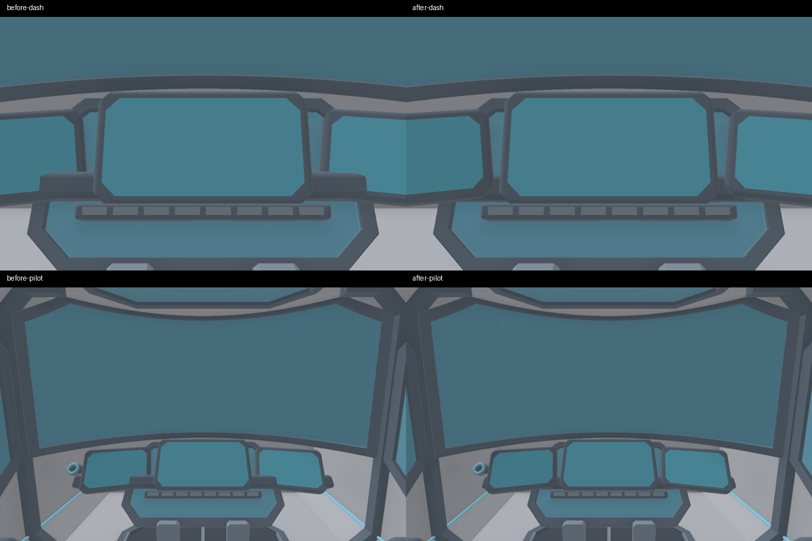

# Environment improvements and XR-40 display clearance: v3.39 review branch

Prepared 9 October 2026 for Claude to review and merge. Target remains **RTX 3070, native 1920×1080, minimum 60 FPS**; hardware performance is unmeasured here.

## Base and scope

Parent: `6f0eb23e3ffb5925c60f3e2befa2a1fa3fcd743d`, the default branch after v3.39.0 plus Claude's stationary XR-40 storm diagnostic. It descends from release commit `e9ec52d5eae709c25ffb5e804af6c968f9ffc2b4` and its release-note reset `8c1aee9324a70156aa182a94d03512ed708cf461`. That diagnostics update merged cleanly and is retained. The earlier environment proposal was prepared on `a7f8d30ec39c89dacded275e33a8750d6719138c`; this is an integrated port, not an old checkout overlaid onto the release.

The branch contains environment geometry/material improvements, benchmark instrumentation/tests, and the owner's requested small XR-40 dashboard fix. It does not alter scenery placement, terrain heights, collisions, flight tuning, career format, landing gear, aircraft performance or the current research-display scheduling. The separate phantom-road/world-cache proposal from the earlier handoff remains unapplied.

## Preserve v3.39's cockpit performance work

- Existing `FLEET_ON`, `JET_ON`, `WRAITH_ON` and `RESEARCH_ON` definitions and guarded shape/material/light dispatch remain intact.
- The separate fleet, XR-30 and XR-40 mesh programs and per-aircraft selection remain intact. No fleet-only code was added to their shared paths.
- The XR-40 support remains inside the existing Wraith cockpit geometry path, reached through the existing `WRAITH_ON` guard.
- `matSample`, `triSample` and `applyTS` remain byte-identical to v3.39. In particular, the 2% projection cutoff, renormalization and conditional texture reads in `triSample` are preserved.
- The new terrain normal-frame helper now preserves that same projection-skipping optimization. The initial port's unconditional terrain reads were identified in review and corrected before publication.
- All six ground/terrain-only material helpers are preprocessed out of `AF_MESH` builds. Non-mesh shared programs still contain unreachable helper definitions; no measured register/timing claim is made for those programs.
- `tests/aircraft_specialization_test.py` guards family defines, material guards, mesh dispatch, projection skipping and terrain-helper exclusion. Optional glslang preprocessing/linking uses the real assembled shaders.

## Environment changes

- Broadleaf alpha-cutout uses four conservative candidate cells instead of nine, with identical coverage in 911,400 tested comparisons; distant micro-normal work fades out smoothly.
- Palm fractional-power calculation is clamped to avoid nonfinite tip vertices. Previous authored close foliage geometry and density are retained.
- Far outcrop/spire/sea-stack silhouettes better match their near models without increasing vertex budgets. Their projected area does increase (roughly 12–28% in measured side projections): explicitly profile this fill-rate tradeoff.
- Fix pitched-roof normal orientation and remove coplanar/hidden shop/apartment faces. Add bounded near apartment roof equipment and a canopy within a lower triangle count; vary flat-roof finish with existing samples.
- Correct rotated ground normals and terrain triplanar normal frames. Smooth the 2-km bump-strength step; footprint-filter road/runway markings and fine runway detail; align town road paint with streets.
- Reserve each scenery chunk's known final record count. Earlier byte-for-byte tests of 405 chunks / 247,684 instances preserved placement/order/bounds, with 35–41% lower retained vector capacity in sampled regions. This is not a total-RAM or FPS claim.
- Add raw frame/CPU/app-present and fresh GPU-query diagnostics, quality/resolution/weather/state checks, an 11-case runner and frame-statistics tools. No new per-frame GPU waits or render passes.

Existing scanned textures, draw distance, density, resolution and normal game quality settings are retained. New shader arithmetic is bounded but its GPU cost still needs measurement. The original eight native-1080 environment comparisons were supplied separately; they are historical proposal evidence, not a re-render of this v3.39 port.

## XR-40 support fix

The wide bridge supporting the centre display crossed the inward-canted side display glass. Recess it **35 mm** along the centre-panel normal, preserving screen positions, support width and rear attachment overlaps. Dimensions are centralized in `research_cockpit_layout.glsl` and used by the production Wraith SDF.

The expanded layout regression samples the glass and first 40 mm of pilot sightlines at high density, rather than beginning beyond the obstruction. The old offset reproduces 5,894 intrusions and −13.7 mm worst clearance; the revised geometry gives **20.8 mm minimum analytic clearance**. Rear joint witnesses remain solid. The complete research layout test passes 1,057,616 checks, including focused ASan/UBSan.

The illustration renders actual `mapWraithCockpit` geometry under `AF_WRAITH` using EGL/Mesa and simplified diagnostic materials. It shows close and normal pilot views; it is not a final raster-mesh gameplay render. The extraction lattice is 15.625 mm coarse / 7.8125 mm fine, projects vertices back to the field and targets 0.4 mm simplification error. Analytic clearance is not a rigorous worst-case mesh bound. Verify the final extracted cockpit in-game. Recessing further without another mounting part would weaken the centre-screen rear overlap, so this patch stays minimal.

## Validation

Final local results on this integrated tree: native Release build and **33/33 CTest passed** (91.57 seconds); Windows application and all five focused C++ test targets cross-built successfully. All 11 benchmark fixtures survived 140 simulated seconds in separate CPU-only processes with isolated settings. Independent source review found no remaining blocking defect after the terrain projection-skip correction.

- Native Release build and CTest: **33/33 passed**.
- Windows x64 application and focused test targets: LLVM-MinGW cross-build; Windows execution is not claimed.
- Offline GLSL: all 38 assembled shaders validated/linked, including research specializations; terrain helpers excluded from all five mesh variants and retained in terrain/map.
- Terrain arithmetic: 132,185 production-extracted checks, including projection threshold/renormalization; all earlier arithmetic cases retained.
- Benchmark frame/statistics tests and query mock: passed.
- Benchmark fixtures: **11/11 survived 140 simulated seconds**, rerun against this integration in fresh processes. It does not measure rendering or display cadence.

GitHub's Windows/MSVC and Linux sanitizer checks are expected to run on this review branch. Treat their exact-commit results separately from the local cross-build. No production merge or release is requested from this branch automatically.

## Review/acceptance on the RTX 3070

1. Build this branch and compare with v3.39.0 at the same explicit quality, native 1920×1080 and 100% render scale. Preserve shader-family selection and display scheduling.
2. Inspect the XR-40's two side screens from the normal pilot eye and through look-to-focus motion, including extracted mesh edges and support attachment.
3. Check moving roads/runways, trees and rock LODs; roofs and terrain in day/night/wet scenes; GPS map paint at multiple zooms.
4. Run `tools/environment_benchmark.py` and follow `docs/ENVIRONMENT_BENCHMARK.md`; add real moving/streaming gameplay and display-cadence captures. Report tails and worst frames, not average FPS alone.
5. Do not merge world-generation changes merely to fix empty named towns or the phantom road; they require separate placement/collision/cache review.

The CPU/software-GL checks cannot certify the user's 60-FPS minimum. No further increase in scenery density, material resolution or draw distance is bundled here.
