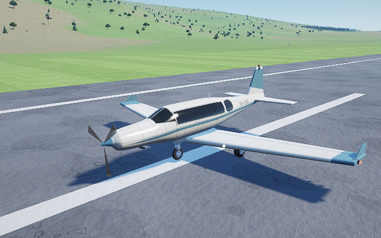
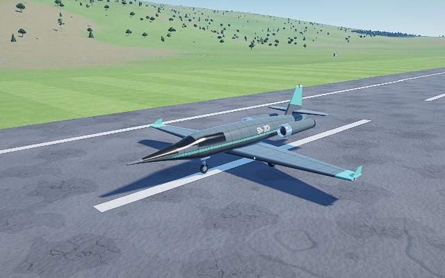
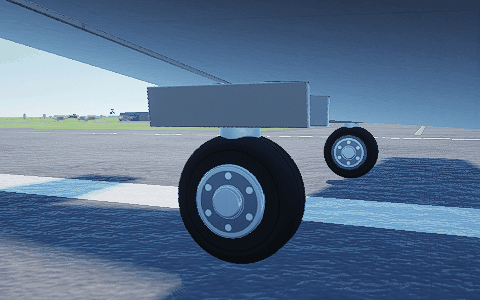

# Aircraft, fleet gear and rotating-wheel review

Prepared for Claude on R0 `db08f7aa334cf3e7c04ed99c6f5caa5bdca63ca6`. This review adds two proposed Tier A aircraft rows, upgrades shared fleet gear, lowers the XR-30 exterior canopy and supplies an optional wheel-animation integration. It does not insert aircraft into the release catalogue or publish a release.

- [Exact guide-format aircraft definitions and self-checks](authoring.md)
- [Integration decisions and source/guide coordinate notes](integration.md)
- [Validation and practical limits](validation.md)
- [Aircraft laboratory commands](../../../prototypes/aircraft/README.md)
- [Rotating-wheel implementation, patch and commands](../../../prototypes/wheel_animation/README.md)

Current-layout tests pass **12/12 suites**, including the **110 candidate flight cases** and **138 wheel checks**. The wheel probe also passes ASan+UBSan, with leak checking disabled for the container limitation. Cosmetic wheel integration leaves the 110 flight-result CSV byte-identical. Historical maximum-guide-weight/career-insertion evidence is labeled 3b; current R0 source identity and render evidence are labeled R0. Software OpenGL proves shader/rig behaviour, not Windows/GPU performance.

## Proposed aircraft

Guide angles and interiors: [Swift](evidence/previews/swift-s6-guide.png), [Nightjar](evidence/previews/xr14-nightjar-guide.png). These six-view sheets use the source-verified 3b renderer and final native rows; R0 front images use the current shader modules.

## Fleet landing gear

Each sheet shows the main and nose/tail wheel. Detailed geometry and finish use the existing radii and deployment paths. The 56-capture gallery also checks all retractable half-gear positions and steering; its manifest/logs record the full run.

| Aircraft | Gear comparison sheet |
|---|---|
| Kestrel T2 | [Main / nose](evidence/previews/kestrel-gear.png) |
| Wren 180 | [Main / nose](evidence/previews/wren-gear.png) |
| Bushmaster STOL | [Main / tailwheel](evidence/previews/bushmaster-gear.png) |
| Islander Twin | [Main / nose](evidence/previews/islander-gear.png) |
| Pelican Caravan | [Main / nose](evidence/previews/pelican-gear.png) |
| Meridian Q400 | [Paired mains / nose](evidence/previews/meridian-gear.png) |
| Starling 500 | [Main / nose](evidence/previews/starling-gear.png) |
| XR-30 Specter | [Main / paired nose](evidence/previews/xr30_specter-specter-gear.png) |
| XR-40 Wraith | [Main / paired nose](evidence/previews/xr40_wraith-wraith-gear.png) |
| Swift S6 | [Main / nose](evidence/previews/swift-s6-gear.png) |
| XR-10 Nightjar | [Main / nose](evidence/previews/xr14-nightjar-gear.png) |

## XR-30 exterior canopy

Crown lowered 11 cm; the 0.16 m shoulder blend retains the opaque sensor-film material and sealed cockpit. Before uses 3b and after uses R0 at the same body-relative camera, resized to the same panel size.

## Prepared wheel animation

The loop is twelve frozen rig poses at five-degree increments, demonstrating the wheel's rotating bolt pattern. Ground rollout, reverse travel, parking, pause, per-contact radii and AI motion are independently tested in the native probe.

Aircraft phase sheets: [Swift / Nightjar / XR-30](evidence/previews/aircraft-wheel-phases-r0.png). Ground-driver phase sheets: [GA plane](evidence/previews/ground-ga-wheel-phases-r0.png), [airliner](evidence/previews/ground-airliner-wheel-phases-r0.png), [car](evidence/previews/ground-car-wheel-phases-r0.png), [fuel bowser](evidence/previews/ground-truck-wheel-phases-r0.png). The ground fixtures advance actual position by the distance corresponding to a quarter turn and follow it with the camera; existing scenery remains parked.

[Wraith nose-wheel SPIN under half-retracted gear](evidence/previews/wraith-folded-wheel-phases-r0.png) verifies its distinct belly-flush deployment frame.
