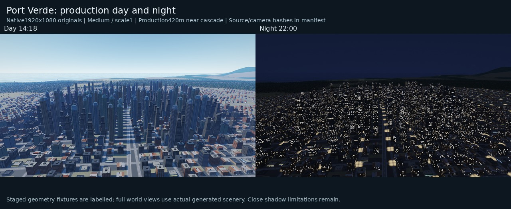
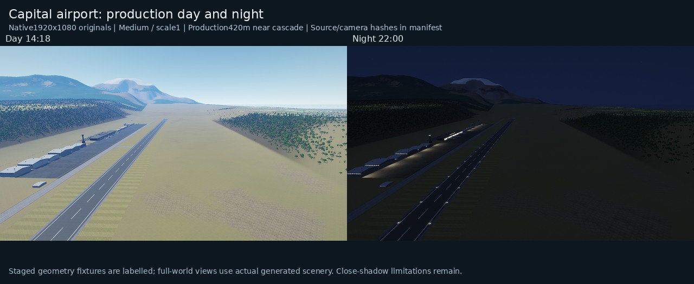
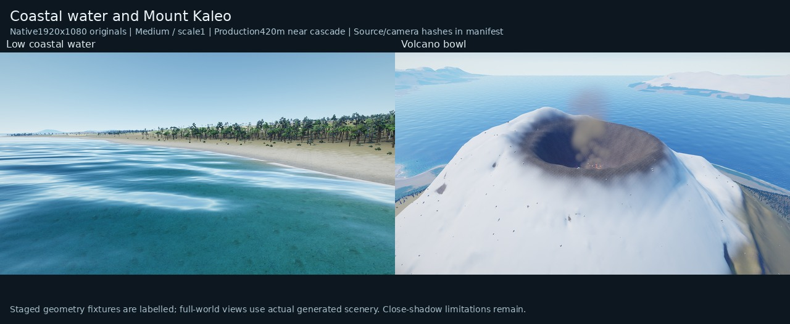
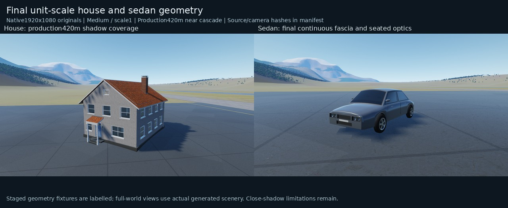
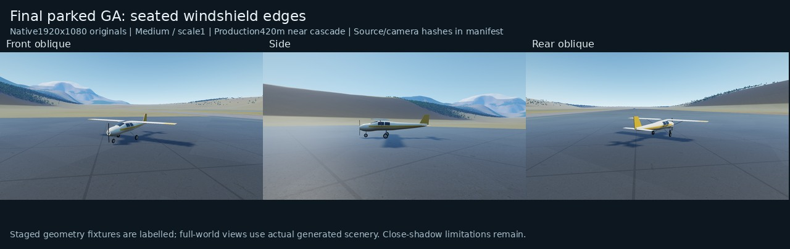
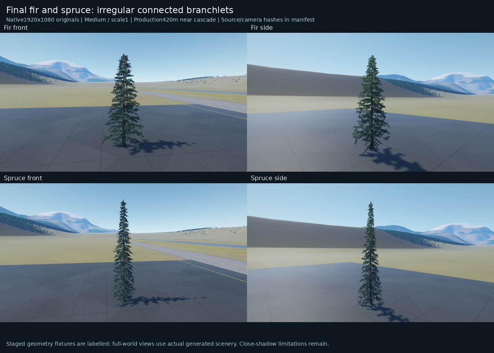

# Final render-evidence selection

These small inspection boards preserve the actual renderer output, with only aspect-preserving downsampling and labels. Lossless1920×1080 originals remain in the existing capture folder. `manifest.json` records every native hash, camera, source snapshot, executable and selected accepted-runtime hash.

All images use Medium quality, scale1 and the original production near-cascade footprint420m. Full startup compiled34programs and loaded seven high-resolution plus seven fallback material layers. Software-render wall times are not GPU performance measurements.

The world views use the immutable v7 renderer: its selected renderer/world/mesh/shader/material inputs match the restored accepted checkout. The v6 house/car/GA/conifer views have the final geometry; their sole shader difference is the later office/skyscraper night-emission branch, which these daytime kinds do not execute. This exception is recorded per image, rather than relabelling those captures as v7.

Known close-shadow lobes and serration remain, especially below house eaves and apartment balconies. Narrower96/160/256m experiments improved close sampling but lost acceptable farther ground-shadow coverage or retained visible lobes, so the adaptive production proposal was rejected. None of those diagnostic-radius images are selected here. The assets have defect-specific geometry checks; this selection is not a blanket photorealistic-quality claim.

## Port Verde: production day and night

## Capital airport: production day and night

## Coastal water and Mount Kaleo

## Final unit-scale house and sedan geometry

## Final parked GA: seated windshield edges

## Final fir and spruce: irregular connected branchlets

